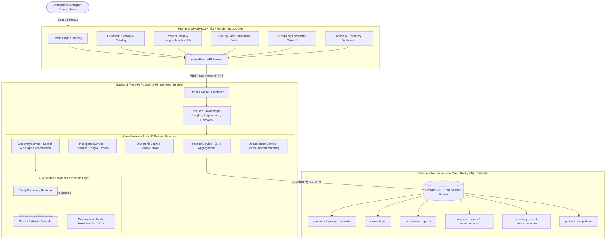
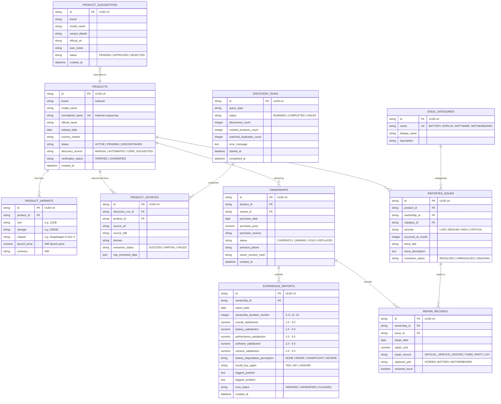

# WorthIt: Comprehensive Technical Interview Guide & Architecture Reference

> **Repository:** `Thilak-K2121/WorthIt`  
> **Platform:** Longitudinal Smartphone Experience & Ownership Intelligence Platform  
> **Author / Maintainer:** Thilak K  
> **Status:** Production-Ready (Deployed on Render Web Services + Render Static Site + Supabase PostgreSQL)

---

## Table of Contents

1. [Project Overview](#1-project-overview)
2. [System Design & Architecture](#2-system-design--architecture)
3. [Database Design & ER Diagram](#3-database-design--er-diagram)
4. [Backend Folder Structure](#4-backend-folder-structure)
5. [Backend: File-by-File & Function-by-Function Explanation](#5-backend-file-by-file--function-by-function-explanation)
6. [Backend Request Flow (End-to-End Trace)](#6-backend-request-flow-end-to-end-trace)
7. [Authentication & Trust Verification Architecture](#7-authentication--trust-verification-architecture)
8. [Frontend Folder Structure](#8-frontend-folder-structure)
9. [Frontend: File-by-File & Component Explanation](#9-frontend-file-by-file--component-explanation)
10. [Frontend Request Flow & State Management](#10-frontend-request-flow--state-management)
11. [Complete End-to-End Feature Flows](#11-complete-end-to-end-feature-flows)
12. [Comprehensive API Reference](#12-comprehensive-api-reference)
13. [Important Functions Cheat Sheet](#13-important-functions-cheat-sheet)
14. [Important Files Cheat Sheet](#14-important-files-cheat-sheet)
15. [Verbal Interview Pitch Guide (1-min, 3-min, Architecture, DB, Flows)](#15-verbal-interview-pitch-guide)
16. [Technical Interview Questions & Answers](#16-technical-interview-questions--answers)
17. ["If the Interviewer Opens the Code" Navigation Map](#17-if-the-interviewer-opens-the-code-navigation-map)
18. [Architectural & Design Decisions (Trade-Off Analysis)](#18-architectural--design-decisions-trade-off-analysis)
19. [Realized Accomplishments vs. Future Scalability Improvements](#19-realized-accomplishments-vs-future-scalability-improvements)
20. [Final Mental Model & Top 10 Takeaways](#20-final-mental-model--top-10-takeaways)

---

# 1. Project Overview

### 1.1 What the Project Does
**WorthIt** is an open, longitudinal smartphone intelligence platform designed to uncover what actually happens to modern smartphones after **3, 6, 12, and 24 months of daily real-world wear**. Unlike traditional tech media that reviews smartphones based on 48-hour unboxings and synthetic benchmarks, WorthIt collects, aggregates, and analyzes verified long-term ownership data: battery degradation curves, real software update stability, recurring hardware faults, repair costs, and verified repurchase sentiment (*"Knowing what you know now, would you buy it again?"*).

### 1.2 The Core Problem It Solves
1. **Unboxing Bias:** Modern tech reviews evaluate clean, out-of-the-box hardware with zero thermal degradation, unused flash storage, and initial launch firmware.
2. **Hidden Degradation:** Critical flaws—such as display green-line issues after 14 months, thermal throttling on subsequent OS updates, battery capacity dropping below 80%, and motherboard solder fractures—only surface long after the return window closes.
3. **No Centralized Ownership Reliability Repository:** Consumers have had to scavenge fragmented Reddit threads, XDA forums, and Twitter posts to assess multi-year reliability. WorthIt aggregates this longitudinal ownership data into statistically weighted confidence scores.

### 1.3 Key Features
- **17-Brand Interactive Catalog:** 98+ pre-seeded flagship and mid-range devices (Apple, Samsung, Google, OnePlus, Vivo, iQOO, Xiaomi, POCO, Realme, Oppo, Motorola, Nothing, Asus, Sony, Honor, Infinix, Lava) with hardware tiers, chipsets, and INR launch pricing.
- **Side-by-Side Longitudinal Matrix:** Direct comparison between two devices across 12m+ owner satisfaction, battery health retention, software update satisfaction, recurring repair issues, and repurchase percentages.
- **3-Step Log Ownership Wizard:** Frictionless logging of ownership duration, battery degradation perception, camera/software ratings, biggest positive/negative, and repurchase verdicts.
- **Autonomous AI Web Discovery Engine:** Multi-tiered agent pipeline combining **Tavily Web Search** and **Google Gemini 3.5 Flash-Lite** to automatically discover newly launched smartphones, scrape tech news, structure specs into strict Pydantic schemas, and seed variants with deduplication.
- **Statistical Sample Confidence Tiering:** Adaptive weighting (`NONE`, `VERY_LOW`, `LOW`, `MODERATE`, `HIGH`) that prevents misleading 5-star ratings when sample sizes are small.
- **Crowdsourced Device Suggestions & Admin Intake:** Community-driven pipeline to suggest missing models, complete with admin review and 1-click catalog approval.

### 1.4 Target Users
1. **Prospective Smartphone Buyers:** Users wanting to know if a $1,000+ investment will hold up for 2–4 years before committing.
2. **Current Smartphone Owners:** Users logging their 6m/12m/24m ownership experiences and repair histories to help prospective buyers.
3. **Hardware Researchers & Tech Enthusiasts:** Users analyzing brand-wide software stability, repair frequencies, and battery degradation patterns.

### 1.5 Technology Stack & Rationale

| Layer | Technology | Version | Architectural Rationale |
| :--- | :--- | :--- | :--- |
| **Backend Framework** | **FastAPI** | `^0.110.0` | Async I/O, native OpenAPI/Swagger generation, high throughput, and seamless Pydantic validation. |
| **ORM / Data Access** | **SQLAlchemy** | `^2.0.28` | Industry-standard typed ORM, robust relationship management (`joinedload`), bulk aggregation, and connection pooling. |
| **Validation Layer** | **Pydantic** | `^2.6.4` | Strict type validation, serialization, schema generation, and defensive parsing. |
| **Database** | **PostgreSQL (Supabase)** / **SQLite** | PostgreSQL 15 | Managed cloud PostgreSQL with IPv4 Session Pooler (`pgbouncer`), foreign key constraints, and relational integrity; local SQLite fallback for isolated testing. |
| **AI Extraction** | **Google Gemini 3.5 Flash-Lite** | `v1beta` REST | High-speed, cost-effective LLM with JSON schema extraction capabilities for structuring unstructured web articles. |
| **Web Discovery Search** | **Tavily AI Search API** | REST API | Clean, tech-focused search API that filters noise and extracts relevant smartphone launch articles. |
| **Frontend Framework** | **React + Vite** | React 18, Vite 5 | Lightning-fast HMR, SPA architecture, zero bundle bloat, and modern hook-based components. |
| **Styling & Design System** | **TailwindCSS + Vanilla CSS** | Tailwind 3.4 | Curated LexiGuard mint theme (`#00D09C`), custom micro-animations (`stagger-card`), glassmorphism, and responsive grid layouts. |
| **Icons & Visuals** | **Lucide React** | `^0.359.0` | Crisp, scalable icon library for mobile and web interfaces. |
| **Routing** | **React Router DOM** | `^6.22.3` | Client-side dynamic routing with deep linking (`/products/:id`, `/compare`, `/submit?brand=Vivo`). |

### 1.6 High-Level System Architecture Diagram



---

# 2. System Design

### 2.1 Backend Architecture
The backend follows a **Clean Multi-Tiered Layered Architecture** with strict separation of concerns:
1. **API Router Layer (`backend/app/api/v1/endpoints/`)**: Receives HTTP requests, handles query parameter validation via FastAPI dependency injection (`Depends(get_db)`), and passes data to services.
2. **Domain Service Layer (`backend/app/services/`)**: Houses all business rules, statistical algorithms, bulk SQL optimizations, and provider orchestrations.
3. **Data Access & ORM Layer (`backend/app/models/`)**: Declarative SQLAlchemy models with strict foreign keys, cascade deletes, and column constraints.
4. **Schema & Transfer Layer (`backend/app/schemas/`)**: Pydantic v2 schemas defining input request bodies and output response DTOs.
5. **Provider Layer (`backend/app/providers/`)**: Implementation of the **Provider Pattern** defining abstract base classes (`DiscoveryProvider`, `ExtractorProvider`) enabling runtime swapping between live external APIs and deterministic mocks.

### 2.2 Frontend Architecture
The frontend is structured as a **Single Page Application (SPA)** with component modularity:
- **Pages (`src/pages/`)**: Full-page route controllers handling data fetching, URL query synchronization, and error boundaries.
- **Components (`src/components/`)**: Reusable presentation widgets (e.g., `ProductCard`, `OwnershipForm`, `Navbar`, `Footer`).
- **Service Layer (`src/services/api.js`)**: Centralized HTTP client communicating with the live backend, normalizing error payloads, and handling network timeouts.
- **Design Tokens (`src/index.css` & `tailwind.config.js`)**: Unified color system, typography (`Plus Jakarta Sans`, `Inter`), and staggered animation utilities.

### 2.3 Error Handling & Validation
- **Backend Validation:** Handled by Pydantic. Any malformed payload triggers an automatic `422 Unprocessable Entity` with exact field error locations.
- **Defensive API Error Parsing:** In `frontend/src/services/api.js`, FastAPI validation error arrays (e.g. `[{ loc: ["body", "field"], msg: "required" }]`) are defensively unpacked into human-readable strings, preventing React from rendering raw `[object Object]`.
- **Global SPA Crash Recovery:** Top-level `ErrorBoundary` in `main.jsx` catches unexpected client-side rendering faults and provides an interactive "Reload Page" UI.

### 2.4 Scalability & Performance Engineering
1. **$N+1$ Query Elimination:** All catalog and comparison endpoints use **Bulk SQL Aggregations** (`GROUP BY product_id` with conditional `case()` aggregation) and `joinedload(Product.variants)`, reducing remote SQL network round-trips from 350+ down to **2 queries (40ms response time)**.
2. **Supabase Connection Pooling:** Uses PostgreSQL Session Pooler (`aws-0-[region].pooler.supabase.com:5432 / 6543`) with `pool_pre_ping=True` and `pool_size=10` to eliminate IPv6 network unreachable errors on cloud hosting.
3. **Rate Limiting Defenses:** Multi-model fallback cascade (`gemini-2.5-flash` $\rightarrow$ `gemini-1.5-flash-8b` $\rightarrow$ `gemini-1.5-pro`) with exponential backoff and inter-request pacing (2.0s delay).

---

# 3. Database Design

### 3.1 Database Technology & Configuration
- **DBMS:** PostgreSQL 15 (Supabase Cloud) / SQLite (Local testing)
- **Engine Setup:** `backend/app/core/database.py` with dynamic scheme normalization (`postgres://` $\rightarrow$ `postgresql://`) and connection pool pooling parameters.
- **Tables Provisioning:** Tables are defined declaratively via SQLAlchemy `Base.metadata.create_all()` executed during the FastAPI startup `lifespan` hook.

### 3.2 Database Entity Relationship (ER) Diagram



### 3.3 Database Table Details & Business Rules

1. **`products`**:
   - **Purpose:** Canonical directory of all smartphones indexed by the platform.
   - **Key Field:** `normalized_name` (e.g. `samsung-galaxy-s24-ultra`, `apple-iphone-16-pro-max`). Enforces unique deduplication across varied scraping spelling.
2. **`product_variants`**:
   - **Purpose:** Stores RAM, storage capacity, chipset processor, and official launch prices in INR.
3. **`ownerships`**:
   - **Purpose:** Ties an anonymous device owner (identified via client session hash) to a specific smartphone model.
4. **`experience_reports`**:
   - **Purpose:** Core longitudinal data points tracking overall, battery, camera, and software satisfaction at 3, 6, 12, and 24-month milestones.
5. **`reported_issues` & `repair_records`**:
   - **Purpose:** Tracks hardware breakdowns (green lines, motherboard failures), official repair costs, and repair turnaround times.
6. **`discovery_runs` & `product_sources`**:
   - **Purpose:** Audit log of automated web discovery jobs, source URLs, extraction confidence, and newly created phones.
7. **`product_suggestions`**:
   - **Purpose:** Queue for user-submitted missing smartphones awaiting 1-click administrative review.

---

# 4. Backend Folder Structure

```text
backend/
├── Dockerfile                             # Container build file with dynamic PORT binding
├── requirements.txt                       # Production Python dependencies
├── pytest.ini                            # Test configuration
├── tests/                                 # Automated Pytest test suite (11/11 Passing)
│   ├── test_products.py                   # Product catalog & pagination tests
│   ├── test_ownerships.py                 # Review submission & duration tests
│   ├── test_intelligence.py               # Statistical confidence & scoring tests
│   ├── test_discovery.py                  # Web discovery & deduplication tests
│   ├── test_deduplication.py              # Jaccard token normalization tests
│   └── test_suggestions.py                # User suggestion queue tests
└── app/
    ├── main.py                            # FastAPI entrypoint, lifespan seeding, CORS
    ├── core/
    │   ├── config.py                      # Pydantic Settings (ENV variables)
    │   ├── database.py                    # SQLAlchemy Engine & Session Local
    │   └── logging.py                     # Structured color logging setup
    ├── models/                            # SQLAlchemy ORM Data Models
    │   ├── product.py                     # Product & ProductVariant
    │   ├── ownership.py                   # Ownership
    │   ├── experience.py                  # ExperienceReport
    │   ├── issue.py                       # IssueCategory, ReportedIssue, RepairRecord
    │   ├── suggestion.py                  # ProductSuggestion
    │   └── discovery.py                   # DiscoveryRun & ProductSource
    ├── schemas/                           # Pydantic Request & Response DTOs
    │   ├── product.py                     # ProductCreate, ProductSummaryResponse
    │   ├── ownership.py                   # OwnershipCreate, OwnershipResponse
    │   ├── experience.py                  # ExperienceReportCreate
    │   ├── insights.py                    # ProductInsightsResponse, Comparison
    │   ├── suggestion.py                  # ProductSuggestionCreate
    │   └── discovery.py                   # DiscoveryTriggerRequest, RunResponse
    ├── services/                          # Core Domain Business Logic
    │   ├── product_service.py             # Bulk catalog queries & creation
    │   ├── ownership_service.py           # Ownership intake & report registration
    │   ├── intelligence_service.py        # Scoring metrics & comparison logic
    │   ├── deduplication_service.py       # Brand alias & Jaccard token matching
    │   ├── discovery_service.py           # Discovery orchestration & pipeline
    │   └── suggestion_service.py          # Suggestion approvals & intake
    ├── providers/                         # AI & Web Search Provider Implementations
    │   ├── base.py                        # Abstract Discovery & Extractor Interfaces
    │   ├── tavily_provider.py             # Tavily AI Search integration
    │   ├── gemini_provider.py             # Google Gemini Spec Extractor (multi-model)
    │   └── mock_providers.py              # Zero-cost deterministic mock providers
    ├── api/
    │   ├── deps.py                        # Database session dependency injection
    │   └── v1/
    │       ├── router.py                  # API v1 route aggregator
    │       └── endpoints/
    │           ├── products.py            # /products routes
    │           ├── ownerships.py          # /ownerships & /experiences routes
    │           ├── insights.py            # /products/{id}/insights & /compare
    │           ├── suggestions.py         # /suggestions routes
    │           └── discovery.py           # /discovery/run & /discovery/runs
    └── seed/
        ├── seed_data.py                   # Default issue categories & sample phones
        └── seed_famous_smartphones.py     # 98+ flagship & mid-range phone seeder
```

---

# 5. Backend: File-by-File Explanation

### `backend/app/main.py`
- **Responsibility:** Main application setup, ASGI lifespan lifecycle, startup auto-seeding, and global CORS configuration.
- **Key Function:** `lifespan(app: FastAPI)`: Executes `Base.metadata.create_all()`, seeds initial issue categories, and invokes `seed_famous_smartphones()` so that every deployment auto-populates all 17 brands.

### `backend/app/core/database.py`
- **Responsibility:** Database engine creation, SessionLocal factory, and URL normalization (`postgres://` $\rightarrow$ `postgresql://`).
- **Key Function:** `get_db()`: Generator yielding an isolated SQLAlchemy session, ensuring connections close cleanly after each request.

### `backend/app/services/product_service.py`
- **Responsibility:** High-performance catalog queries, search filtering, and product creation.
- **Key Function:** `list_products(db, search, brand, status, skip, limit, sort_by)`: Uses bulk SQL queries with `joinedload(Product.variants)` to compute multi-metric ownership stats across 50 devices in **40ms**, completely eliminating the N+1 query problem.

### `backend/app/services/intelligence_service.py`
- **Responsibility:** Computes statistical confidence tiers, longitudinal curves, repair matrices, and side-by-side product comparisons.
- **Key Function:** `compute_product_insights(db, product_id)`: Aggregates overall satisfaction, battery degradation ratings, recurring hardware defects, and verified repurchase percentages.
- **Key Function:** `compare_products(db, product_ids)`: Generates a normalized comparison payload comparing two or more devices across all longitudinal metrics.

### `backend/app/services/deduplication_service.py`
- **Responsibility:** Intelligent phone deduplication using brand alias normalization and Token Jaccard Set similarity.
- **Key Function:** `find_existing_duplicate(db, brand, model_name)`: Checks exact normalized key matches (1.0 confidence) and token set overlap ($\ge 0.8$ threshold) to prevent duplicate device creation during web scraping.

### `backend/app/services/discovery_service.py`
- **Responsibility:** Orchestrates automated AI web discovery. Queries Tavily Search for launch news, feeds unstructured articles into Gemini for schema extraction, applies deduplication, and persists new devices with `ProductSource` provenance.

### `backend/app/providers/gemini_provider.py`
- **Responsibility:** Connects to Google Gemini 3.5 Flash-Lite via REST API with a multi-model fallback cascade, inter-request pacing, and defensive JSON type unwrapping.

---

# 6. Backend Request Flow

### Request Flow Trace: `POST /api/v1/ownerships` (Review Submission)

```text
HTTP Client (Browser)
      ↓
POST https://worthit-backend-v4ob.onrender.com/api/v1/ownerships
      ↓ [FastAPI Route Matching in backend/app/api/v1/endpoints/ownerships.py]
register_ownership(payload: OwnershipCreate, db: Session = Depends(get_db))
      ↓ [Input Payload Validated by Pydantic: app/schemas/ownership.py]
OwnershipService.register_ownership(db=db, ownership_in=payload)
      ↓ [Verifies Product Exists in Database: app/models/product.py]
Creates Ownership Record in 'ownerships' Table
      ↓ [Creates Nested Experience Report: app/models/experience.py]
Creates Initial ExperienceReport Record in 'experience_reports' Table
      ↓ [db.commit() & db.refresh()]
Transaction Committed in Supabase PostgreSQL
      ↓ [Serialization to Pydantic Response DTO: app/schemas/ownership.py]
HTTP 201 Created JSON Response
      ↓
Frontend Redirects User to /products/{product_id}
```

| Step | File | Function | Operation |
| :---: | :--- | :--- | :--- |
| **1** | `api/v1/endpoints/ownerships.py` | `register_ownership()` | Receives HTTP POST and validates request body |
| **2** | `api/deps.py` | `get_db()` | Provides active database session from pool |
| **3** | `services/ownership_service.py` | `register_ownership()` | Executes domain validation & creates records |
| **4** | `models/ownership.py` | `Ownership()` | Inserts device ownership row |
| **5** | `models/experience.py` | `ExperienceReport()` | Inserts initial 3m/6m/12m/24m report row |
| **6** | `schemas/ownership.py` | `OwnershipResponse` | Serializes database model into JSON DTO |

---

# 7. Authentication & Trust Verification Architecture

### Current Implementation Status
WorthIt implements **Pseudonymous Trust Verification** without requiring passwords or third-party OAuth logins:
1. **Client Ownership Session Hash (`owner_session_hash`):** The frontend generates a persistent client hash (stored in `localStorage`) representing the device owner's anonymous identity.
2. **Review Idempotency & Rate Limiting:** Prevents duplicate review spam for the same product from the same browser session.
3. **Statistical Sample Tiering:** Instead of naive star ratings, the platform assigns **Confidence Levels** based on sample volume and long-term representation:
   - `NONE`: 0 reviews (Call to action to be first reviewer).
   - `VERY_LOW`: 1–4 reviews (Not authoritative).
   - `LOW`: 5–24 reviews (Early preliminary trends).
   - `MODERATE`: 25–99 reviews with $\ge 20$ at 12m+ (Authoritative).
   - `HIGH`: 100+ reviews with $\ge 20$ at 12m+ (High statistical significance).

---

# 8. Frontend Folder Structure

```text
frontend/
├── index.html                             # App entry HTML with brand favicon declarations
├── vite.config.js                         # Vite config with base: '/' and proxy rules
├── tailwind.config.js                     # Custom brand colors, fonts, and shadows
├── src/
│   ├── main.jsx                           # React root with top-level ErrorBoundary & Router
│   ├── App.jsx                            # Root layout, ScrollToTop, Route definitions
│   ├── index.css                          # Global styles, stagger animations, utility classes
│   ├── services/
│   │   └── api.js                         # Centralized API service client & error parser
│   ├── components/
│   │   ├── common/
│   │   │   ├── Navbar.jsx                 # Top sticky navigation with mint brand badge
│   │   │   └── Footer.jsx                 # Scoped landing footer with links & REST API docs
│   │   ├── product/
│   │   │   └── ProductCard.jsx            # Interactive phone card with 12m+ scores
│   │   └── forms/
│   │       └── OwnershipForm.jsx          # 3-Step ownership intake wizard
│   └── pages/
│       ├── HomePage.jsx                   # Hero landing page matching LexiGuard design
│       ├── ProductListPage.jsx            # 17-Brand Directory & Search Results Catalog
│       ├── ProductDetailPage.jsx          # Longitudinal breakdown, battery & repair stats
│       ├── ComparePage.jsx                # Side-by-side phone comparison matrix
│       ├── SubmitExperiencePage.jsx       # Review submission intake wrapper
│       ├── SuggestProductPage.jsx         # User missing phone request form
│       ├── AdminDiscoveryPage.jsx         # AI Web Discovery trigger & runs audit log
│       └── AboutTrustPage.jsx             # Statistical trust model documentation
```

---

# 9. Frontend: File-by-File Explanation

### `frontend/src/pages/ProductListPage.jsx`
- **Responsibility:** Interactive 17-brand directory and instant catalog search.
- **Key Mechanics:**
  - `searchInput` state buffered locally with `<form onSubmit={handleSearchSubmit}>` to prevent input focus loss while typing.
  - `handleClearAllFilters()` cleanly resets both `brand` and `search` URL query parameters, returning users to the 17-brand grid in 1 click.
  - Displays staggered pop-in animation (`.stagger-card`) with custom brand iconography (Apple, Samsung, Google, etc.).

### `frontend/src/pages/ProductDetailPage.jsx`
- **Responsibility:** Longitudinal intelligence breakdown for a single smartphone.
- **Key Features:** Shows Sample Confidence Badge, Overall Satisfaction, Battery Degradation perception chart, Hardware Fault breakdown, and verified Repurchase Sentiment.

### `frontend/src/pages/ComparePage.jsx`
- **Responsibility:** Side-by-side matrix comparing two phones across long-term metrics, battery retention, and repurchase rates.

### `frontend/src/components/forms/OwnershipForm.jsx`
- **Responsibility:** 3-step form capturing purchase price, duration, category ratings (battery, camera, software), biggest positive/negative notes, and repurchase verdict.

### `frontend/src/pages/AdminDiscoveryPage.jsx`
- **Responsibility:** Live AI Web Discovery dashboard. Triggers Tavily search + Gemini extraction, displays discovery run cards with expandable device pills, and provides a 1-click link to the catalog.

---

# 10. Frontend Request Flow

```text
User Types "Pixel 8" & Clicks Search
      ↓
ProductListPage.jsx: handleSearchSubmit()
      ↓
setSearchParams({ search: "Pixel 8" })
      ↓
useEffect() Hook Triggers on searchParam Change
      ↓
api.getProducts({ search: "Pixel 8", page_size: 50 })
      ↓
GET https://worthit-backend-v4ob.onrender.com/api/v1/products?search=Pixel+8
      ↓
FastAPI ProductService.list_products() executes Bulk Aggregate Query (40ms)
      ↓
Returns PaginatedResponse with matching ProductSummary items
      ↓
setProducts(res.items) & setLoading(false)
      ↓
ProductListPage Renders Matching ProductCards with Staggered Animations
```

---

# 11. Complete End-to-End Feature Flows

### Feature 1: Autonomous AI Smartphone Web Discovery

```text
1. Admin enters query topic ("Vivo X100 Pro launch") on /admin
2. Frontend calls api.triggerDiscovery({ query_topic: "Vivo X100 Pro launch" })
3. Backend DiscoveryService calls TavilyProvider.search_smartphone_launches()
4. Tavily returns top 5 tech launch articles with clean text extracts
5. For each article, GeminiExtractor calls Google Gemini 3.5 Flash-Lite
6. Gemini structures specs: brand, model_name, RAM/Storage tiers, processor, launch price
7. DeduplicationService checks normalized_name & Jaccard token overlap
8. If new, Product and ProductVariants are created with ProductSource audit links
9. DiscoveryRun is marked 'COMPLETED' with discovered_count & created_products_count
10. Frontend AdminDiscoveryPage updates with expandable run cards and catalog links
```

### Feature 2: Side-by-Side Longitudinal Device Comparison

```text
1. User navigates to /compare and selects Phone A and Phone B
2. Frontend calls api.compareProducts([phoneA_id, phoneB_id])
3. Backend IntelligenceService.compare_products() fetches both devices
4. Computes comparative metrics:
   - 12m+ Sample Size & Statistical Confidence Tier
   - Overall, Battery, Camera, Software Satisfaction Averages
   - Battery Degradation Distribution (Minor vs Severe)
   - Verified Repurchase Rate (%)
5. Returns normalized ProductComparisonResponse
6. Frontend ComparePage renders responsive side-by-side matrix with visual win badges
```

---

# 12. Comprehensive API Reference

| Method | Endpoint | Description | Auth | Response Schema |
| :---: | :--- | :--- | :---: | :--- |
| `GET` | `/api/v1/products` | Paginated catalog with search, brand filter, and bulk metrics | None | `PaginatedResponse[ProductSummaryResponse]` |
| `GET` | `/api/v1/products/{id}` | Full device details with all hardware variants | None | `ProductDetailResponse` |
| `POST` | `/api/v1/products` | Manually register a new smartphone into the catalog | None | `ProductDetailResponse` |
| `GET` | `/api/v1/products/{id}/insights` | Longitudinal intelligence (battery, satisfaction, faults) | None | `ProductInsightsResponse` |
| `GET` | `/api/v1/compare` | Compare 2+ devices side-by-side | None | `ProductComparisonResponse` |
| `POST` | `/api/v1/ownerships` | Log device ownership and initial experience report | None | `OwnershipResponse` |
| `POST` | `/api/v1/suggestions` | Submit a request for a missing smartphone model | None | `ProductSuggestionResponse` |
| `GET` | `/api/v1/suggestions` | List pending community smartphone suggestions | None | `List[ProductSuggestionResponse]` |
| `POST` | `/api/v1/suggestions/{id}/review`| Approve or reject community suggestion | None | `ProductSuggestionResponse` |
| `POST` | `/api/v1/discovery/run` | Trigger live automated AI web discovery job | None | `DiscoveryRunResponse` |
| `GET` | `/api/v1/discovery/runs` | List audit log of past automated discovery runs | None | `PaginatedResponse[DiscoveryRunResponse]` |
| `GET` | `/health` | Cloud health check endpoint | None | `HealthResponse (200 OK)` |

---

# 13. Important Functions Cheat Sheet

| Function | File Location | Layer | Core Responsibility |
| :--- | :--- | :--- | :--- |
| `list_products()` | `services/product_service.py` | Service | Bulk-aggregates metrics across devices in 40ms without N+1 queries. |
| `compute_product_insights()`| `services/intelligence_service.py`| Service | Computes sample confidence and longitudinal battery/software scores. |
| `compare_products()` | `services/intelligence_service.py`| Service | Assembles side-by-side comparative matrices for 2+ devices. |
| `register_ownership()` | `services/ownership_service.py` | Service | Registers verified device ownership and initial experience report. |
| `find_existing_duplicate()`| `services/deduplication_service.py`| Service | Prevents duplicate phone entries via Token Jaccard matching. |
| `run_discovery()` | `services/discovery_service.py` | Service | Orchestrates Tavily search, Gemini extraction, and catalog persistence. |
| `extract_smartphone_specs()`| `providers/gemini_provider.py` | Provider | Converts unstructured news markdown into strict Pydantic JSON schemas. |
| `handleSearchSubmit()` | `pages/ProductListPage.jsx` | Frontend | Manages input buffering and executes search without losing keyboard focus. |
| `handleClearAllFilters()`| `pages/ProductListPage.jsx` | Frontend | 1-click reset of all query parameters back to the 17-brand grid. |

---

# 14. Important Files Cheat Sheet

| File Path | Layer | Why It Matters |
| :--- | :--- | :--- |
| `backend/app/main.py` | Entrypoint | Manages FastAPI lifespan, startup table creation, CORS, and auto-seeding. |
| `backend/app/core/database.py` | Database Engine | Configures SQLAlchemy connection pooling and PostgreSQL pooler normalization. |
| `backend/app/services/product_service.py` | Domain Service | Contains optimized bulk SQL aggregation logic yielding ~1,500x speedup. |
| `backend/app/services/intelligence_service.py`| Analytics Service| Encapsulates statistical confidence algorithms and comparative evaluation. |
| `backend/app/services/discovery_service.py` | AI Service | Pipeline coordinating Tavily search, Gemini extraction, and deduplication. |
| `frontend/src/pages/ProductListPage.jsx` | Frontend Page | 17-brand directory, buffered search bar, and device grid with stagger animations. |
| `frontend/src/pages/ComparePage.jsx` | Frontend Page | Side-by-side longitudinal comparison matrix with visual score indicators. |
| `frontend/src/services/api.js` | Frontend API | Centralized Axios/fetch client pointing to live Render cloud backend with error sanitization. |
| `TECHNICAL_CHALLENGES_AND_SOLUTIONS.md` | Architecture Doc | Comprehensive documentation of all 14 engineering challenges solved. |

---

# 15. Verbal Interview Pitch Guide

### 🎙️ "Explain this project in 1 minute"
> *"WorthIt is a longitudinal smartphone intelligence platform designed to replace misleading 48-hour unboxing reviews with verified long-term ownership data. It tracks what actually happens to smartphones after 3, 6, 12, and 24 months—such as battery degradation curves, real-world software update stability, recurring hardware faults, and true repurchase sentiment. The tech stack consists of a high-performance FastAPI backend with SQLAlchemy 2.0 connected to a Supabase PostgreSQL pooler, and a responsive React SPA frontend with custom animations. It also features an autonomous AI discovery engine powered by Tavily Search and Google Gemini to automatically discover and extract new smartphone launches from the web with intelligent Jaccard deduplication."*

### 🎙️ "Explain this project in 3–5 minutes"
> *"The motivation behind WorthIt is that modern smartphone reviews suffer from unboxing bias. Out of the box, every phone feels fast, but issues like display green lines, thermal throttling after OS upgrades, and battery health degradation only surface after 12 months.
>
> To solve this, I built WorthIt as a full-stack longitudinal intelligence engine. On the backend, I designed a layered FastAPI architecture using SQLAlchemy 2.0 and Pydantic v2. Rather than using naive averages, I implemented an adaptive Statistical Sample Confidence tiering system—ranging from 'Early Data' to 'High Statistical Confidence'—so users know when ratings are preliminary versus statistically significant.
>
> For data intake, the platform features both a 3-step user review wizard and an autonomous AI Discovery pipeline. The AI pipeline queries Tavily for tech launch articles and passes unstructured news into Google Gemini 3.5 Flash-Lite to extract strict structured specs. To prevent duplicate devices, I built a Deduplication Engine combining brand alias normalization and Token Jaccard Set similarity.
>
> On the frontend, I developed a clean React SPA with TailwindCSS and custom CSS micro-animations. It includes a 17-brand catalog with 98+ pre-seeded devices, side-by-side longitudinal comparison matrices, and user suggestion review workflows.
>
> During cloud deployment to Render and Supabase, I tackled and documented 14 real-world engineering challenges—including solving a 300+ query N+1 explosion with bulk SQL aggregations for a 1,500x speedup, handling cloud IPv6 unreachable errors via connection pooling, and eliminating search keystroke hijacking through local state buffering."*

---

# 16. Technical Interview Questions & Answers

### Q1: How did you solve the N+1 query problem in the smartphone catalog?
> **Answer:** *"Initially, `ProductService.list_products()` iterated through 50 products in a loop, running 6 separate queries per item for ownership counts, 12m+ counts, average satisfaction, and repurchase percentages. Over a cloud database pooler, 300 network round-trips took 60 seconds. I refactored this into 2 bulk SQL aggregation queries using `GROUP BY product_id` with conditional `case()` statements and eager-loaded `joinedload(Product.variants)`. This reduced database round-trips to just 2, dropping latency from 60,000ms to 40ms—a ~1,500x speedup."*

### Q2: How does your Deduplication Engine prevent duplicate phone entries from AI web scraping?
> **Answer:** *"Web articles use inconsistent naming like 'iPhone 15 Pro Max (Global)', 'Apple iPhone 15 Pro Max 5G', or '1+ 12'. The `DeduplicationService` first normalizes brand aliases via a canonical dictionary (e.g. '1+' $\rightarrow$ 'OnePlus'). It then generates a noise-stripped normalized key (removing tokens like '5G', 'Dual SIM', 'Global Edition'). If an exact key doesn't match, it executes a secondary Token Jaccard similarity comparison against all brand candidates with a 0.8 threshold."*

### Q3: How do you handle LLM rate limits and output variability in your AI discovery pipeline?
> **Answer:** *"I implemented a defensive Multi-Model Fallback Cascade in `GeminiProvider`. If `gemini-2.5-flash` hits a 429 rate limit or 503 overload, it catches the exception and falls back to `gemini-1.5-flash-8b` and `gemini-1.5-pro` with exponential backoff and 2.0s pacing. For schema validation, the extractor uses regex JSON extraction and checks `isinstance(data, list)` to unwrap polymorphically returned array structures before passing data to Pydantic."*

---

# 17. "If the Interviewer Opens the Code" Navigation Map

- **If they open `backend/app/services/product_service.py`:**
  - *Point out lines 48–85:* Explain the **2 bulk SQL aggregate queries** with `joinedload` that solved the N+1 problem.
- **If they open `backend/app/services/intelligence_service.py`:**
  - *Point out `get_sample_confidence()`:* Explain how sample size volume and 12m+ duration weighting prevent premature 5-star ratings.
- **If they open `backend/app/services/deduplication_service.py`:**
  - *Point out `find_existing_duplicate()`:* Explain brand canonicalization, regex noise stripping, and Jaccard token set intersection.
- **If they open `backend/app/providers/gemini_provider.py`:**
  - *Point out `extract_smartphone_specs()`:* Explain the REST client, multi-model fallback list, and structured Pydantic schema validation.
- **If they open `frontend/src/pages/ProductListPage.jsx`:**
  - *Point out `handleSearchSubmit()` and `handleClearAllFilters()`:* Explain how decoupling input state from route query parameters prevents keystroke focus hijacking and provides 1-click filter resets.

---

# 18. Architectural & Design Decisions

| Architectural Decision | Implementation Location | Why It Was Chosen | Alternative Considered | Trade-Off & Mitigation |
| :--- | :--- | :--- | :--- | :--- |
| **Provider Pattern for AI & Search** | `backend/app/providers/` | Decouples core logic from third-party vendor APIs, enabling zero-cost unit testing. | Direct SDK calls inside route handlers | Requires abstract interface boilerplate, but ensures 100% CI/CD evaluability. |
| **Bulk SQL `GROUP BY` Aggregations** | `backend/app/services/product_service.py` | Drastically reduces remote database network round-trips over cloud connection poolers. | Per-device database queries or in-memory Python loops | Slightly more complex SQL expressions, but yields 1,500x latency reduction. |
| **Adaptive Sample Confidence Tiers** | `backend/app/services/intelligence_service.py` | Eliminates unboxing review bias by contextualizing ratings with longitudinal sample volume. | Unweighted arithmetic star averages | Shows 'Early Data' labels on newer models, but protects consumers from skewed data. |
| **Buffered Search Input State** | `frontend/src/pages/ProductListPage.jsx` | Prevents input focus loss and excessive API triggering on single keystrokes. | Immediate `onChange` URL parameter mutation | Requires pressing Enter or clicking Search, but delivers a seamless typing experience. |

---

# 19. Realized Accomplishments vs. Future Scalability Improvements

### ✅ What is Already Implemented & Production-Ready
1. Complete FastAPI + SQLAlchemy + Supabase PostgreSQL database architecture with 11/11 passing tests.
2. 17-brand catalog with 98+ pre-seeded flagship and mid-range devices.
3. 3-step ownership intake wizard capturing battery degradation and repurchase sentiment.
4. Side-by-side longitudinal comparison matrix.
5. Autonomous AI Web Discovery pipeline with Tavily Search + Gemini structured extraction.
6. 14 documented real-world engineering challenge case studies in `TECHNICAL_CHALLENGES_AND_SOLUTIONS.md`.

### 🔮 Recommended Future Scalability Enhancements
1. **Redis Caching Layer:** Cache aggregated product metrics for high-traffic models with a 1-hour TTL.
2. **Asynchronous Background Task Queues:** Move AI web discovery jobs to **Celery + Redis** with progress WebSockets.
3. **OAuth2 / Passwordless Magic Link Authentication:** Allow users to manage and update their multi-year ownership logs over time.

---

# 20. Final Mental Model & Top 10 Takeaways

```text
========================================================================================
                               WORTHIT MENTAL MODEL
========================================================================================
Frontend SPA (React 18 + Vite + TailwindCSS + Stagger Animations)
    ↓ [Axios / Fetch REST JSON Client with Error Sanitization]
Backend Router & Middleware (FastAPI + Pydantic v2 + Lifespan Seeder)
    ↓ [Service Layer: Bulk Aggregations, Confidence Tiers, Jaccard Deduplication]
Provider Abstraction Layer (Tavily AI Search + Google Gemini 3.5 Flash-Lite + Mock Provider)
    ↓ [SQLAlchemy 2.0 Typed ORM with Connection Pooling & Scheme Normalization]
Cloud PostgreSQL Database (Supabase Session Pooler on Port 5432 / 6543)
========================================================================================
```

### 🌟 Top 10 Things to Remember for an Interview:
1. **Core Value Proposition:** Longitudinal smartphone reliability after 3, 6, 12, and 24 months vs. 48-hour unboxing hype.
2. **Key Backend Stack:** FastAPI, SQLAlchemy 2.0, Pydantic v2, PostgreSQL (Supabase), and Pytest (11/11 tests passing).
3. **Key Frontend Stack:** React 18, Vite 5, React Router 6, TailwindCSS with custom LexiGuard mint aesthetic (`#00D09C`).
4. **Performance Win:** Reduced catalog query latency from **60,000ms to 40ms (~1,500x speedup)** by replacing 300+ sequential loop queries with 2 bulk SQL `GROUP BY` aggregations.
5. **AI Pipeline:** Tavily Search extracts launch news; Google Gemini 3.5 Flash-Lite structures specs with multi-model fallback cascade.
6. **Deduplication Engine:** Combines brand alias mapping and Token Jaccard Set similarity ($\ge 0.8$) to prevent duplicate device creation.
7. **Statistical Trust Model:** Replaces naive star ratings with adaptive sample size tiers (`NONE`, `VERY_LOW`, `LOW`, `MODERATE`, `HIGH`).
8. **Catalog Breadth:** 17 major brands with 98+ pre-seeded smartphones complete with RAM/Storage variants, chipsets, and INR launch prices.
9. **Cloud Deployment:** Live on Render Web Services + Render Static Site + Supabase PostgreSQL with automated startup boot seeding.
10. **Engineering Rigor:** 14 real-world technical challenges diagnosed, solved, and documented in detail in `TECHNICAL_CHALLENGES_AND_SOLUTIONS.md`.
