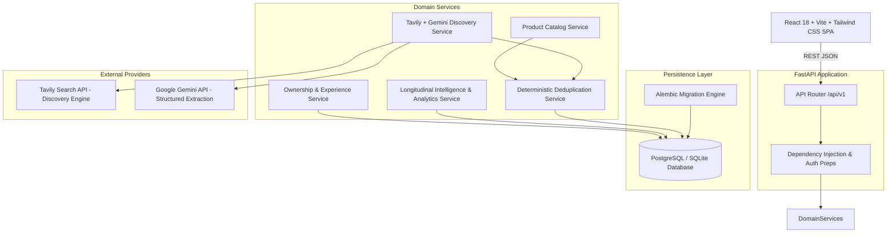

# System Architecture: Long-Term Product Experience Platform (WorthIt)

## 1. System Philosophy
The **Long-Term Product Experience Platform** addresses the fundamental flaw of modern tech reviews: they focus almost exclusively on day-one impressions or 48-hour unboxings. Buyers want to understand what happens after **3, 6, 12, 18, and 24 months** of actual ownership:
- True battery degradation perception
- Thermal behavior under prolonged ownership
- Software update stability and regression bugs
- Service center repair frequencies and median out-of-pocket costs
- Repurchase intent: *"Would you buy this phone again after 1 year?"*

---

## 2. High-Level Architecture Diagram

---

## 3. Core Architectural Modules

### A. Product Catalog & Variant Separation
- Canonical **Products** represent high-level device families (e.g., `Samsung Galaxy S24 Ultra`).
- **Product Variants** capture specific RAM, Storage, Chipset, and Launch Price permutations.

### B. Ownership & Longitudinal Progression
- Owners register a device with purchase date, price, and status.
- Multiple chronological **Experience Reports** attach to a single ownership record over time (e.g. Month 3, Month 6, Month 12).
- Structured **Reported Issues** and **Repair Records** document specific component failures (Screen, Battery, Motherboard) and out-of-pocket costs.

### C. Sample-Size-Aware Intelligence Engine
- All statistical aggregates compute confidence scores dynamically:
  - `< 5 reports`: `VERY_LOW` (*"Early Data — Directional Sample Only"*)
  - `5 - 24 reports`: `LOW` (*"Early Trends"*)
  - `25 - 99 reports`: `MODERATE` (*"Growing Confidence"*)
  - `100+ reports`: `HIGH` (*"High Statistical Confidence"*)
- Automatically segments tenure buckets into milestones (1-3m, 4-6m, 7-12m, 13-18m, 19-24m+).

### D. Automated Discovery Pipeline
- Search: Queries recent smartphone announcements via **Tavily Search API**.
- Extraction: Uses **Google Gemini API** with strict JSON schemas.
- Validation: Validated against **Pydantic v2** models.
- Deduplication: Deterministic normalization rules prevent duplicate catalog pollution.
- Observability: Complete audit records stored in `product_discovery_runs`.
