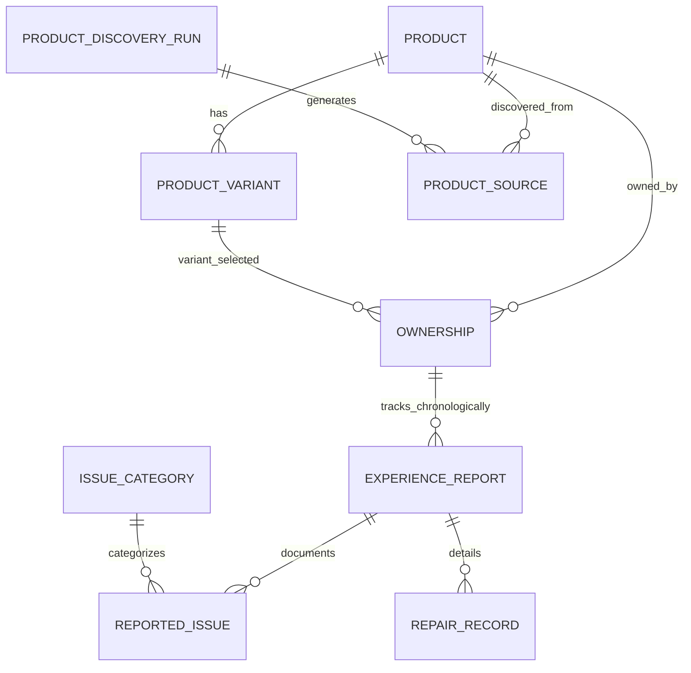

# Database Schema & Relational Design

The platform uses a normalized relational database schema supported on PostgreSQL (and SQLite for local offline development), managed via SQLAlchemy 2.0 and Alembic.

---

## 1. Entity Relationship Diagram

---

## 2. Table Specifications

### `products`
| Column | Type | Constraints | Description |
| :--- | :--- | :--- | :--- |
| `id` | String(36) | PK | UUID Primary Key |
| `brand` | String(100) | NOT NULL, INDEX | Manufacturer brand name |
| `model_name` | String(150) | NOT NULL | Canonical model name |
| `normalized_name` | String(200) | UNIQUE, INDEX | Deterministic deduplication key |
| `official_name` | String(200) | NULLABLE | Full marketing name |
| `release_date` | Date | NULLABLE | Official launch date |
| `country_market` | String(100) | DEFAULT 'Global' | Market identifier |
| `official_url` | String(500) | NULLABLE | OEM website URL |
| `status` | String(50) | DEFAULT 'ACTIVE' | ACTIVE, PENDING, DISCONTINUED |
| `discovery_source`| String(50) | DEFAULT 'MANUAL' | MANUAL, AUTOMATED, USER_SUGGESTED |
| `verification_status`| String(50) | DEFAULT 'VERIFIED' | VERIFIED, UNVERIFIED, FLAGGED |

### `product_variants`
| Column | Type | Constraints | Description |
| :--- | :--- | :--- | :--- |
| `id` | String(36) | PK | UUID Primary Key |
| `product_id` | String(36) | FK -> products.id | Foreign Key to parent Product |
| `ram` | String(50) | NULLABLE | RAM specification (e.g. 12GB) |
| `storage` | String(50) | NULLABLE | Storage (e.g. 256GB) |
| `chipset` | String(150) | NULLABLE | Processor SoC |
| `launch_price` | Numeric(12,2) | NULLABLE | Launch price |
| `currency` | String(10) | DEFAULT 'INR' | Currency code |

### `ownerships`
| Column | Type | Constraints | Description |
| :--- | :--- | :--- | :--- |
| `id` | String(36) | PK | UUID Primary Key |
| `product_id` | String(36) | FK -> products.id | Foreign Key to Product |
| `variant_id` | String(36) | FK -> variants.id | Foreign Key to Variant |
| `purchase_date` | Date | NOT NULL | Purchase date |
| `purchase_price` | Numeric(12,2) | NULLABLE | Price paid |
| `status` | String(50) | DEFAULT 'CURRENTLY_OWNING' | CURRENTLY_OWNING / PREVIOUSLY_OWNED |
| `previous_phone` | String(150) | NULLABLE | Upgraded from device |
| `purchase_source`| String(100) | NULLABLE | Store/channel |
| `owner_session_hash`| String(64) | NULLABLE, INDEX | Anonymized client hash for rate-limiting |

### `experience_reports`
| Column | Type | Constraints | Description |
| :--- | :--- | :--- | :--- |
| `id` | String(36) | PK | UUID Primary Key |
| `ownership_id` | String(36) | FK -> ownerships.id | Foreign Key to Ownership |
| `ownership_duration_months` | Integer | NOT NULL, INDEX | Tenure milestone (e.g. 3, 6, 12, 24) |
| `report_version` | Integer | DEFAULT 1 | Chronological log version |
| `overall_satisfaction` | Numeric(2,1) | NOT NULL | 1.0 to 5.0 |
| `battery_satisfaction` | Numeric(2,1) | NOT NULL | 1.0 to 5.0 |
| `performance_satisfaction` | Numeric(2,1) | NOT NULL | 1.0 to 5.0 |
| `software_satisfaction` | Numeric(2,1) | NOT NULL | 1.0 to 5.0 |
| `battery_degradation_perception` | String(50) | NULLABLE | NONE, MINOR, MODERATE, SEVERE |
| `heating_experience` | String(50) | NULLABLE | COOL, NORMAL, NOTICEABLE_WARMTH, FREQUENT_OVERHEATING |
| `would_buy_again` | String(20) | NOT NULL | YES, NO, UNSURE |
| `would_buy_again_reason` | Text | NULLABLE | Long-term explanation |
| `biggest_positive` | Text | NULLABLE | Qualitative highlight |
| `biggest_problem` | Text | NULLABLE | Qualitative complaint |
| `trust_status` | String(50) | DEFAULT 'SELF_REPORTED' | Verification level |

### `reported_issues` & `repair_records`
- `reported_issues`: Tracks structured failure categories, severity, occurred month, and whether repairs were required.
- `repair_records`: Details specific hardware replacement parts (Screen, Battery, Port), warranty coverage, and repair cost.

### `product_discovery_runs` & `product_sources`
- `product_discovery_runs`: Logs run start/end, source counts, candidates found, extracted count, duplicates detected, and error messages.
- `product_sources`: Stores provenance URL, title, snippet, and raw extracted JSON for every discovered smartphone.
